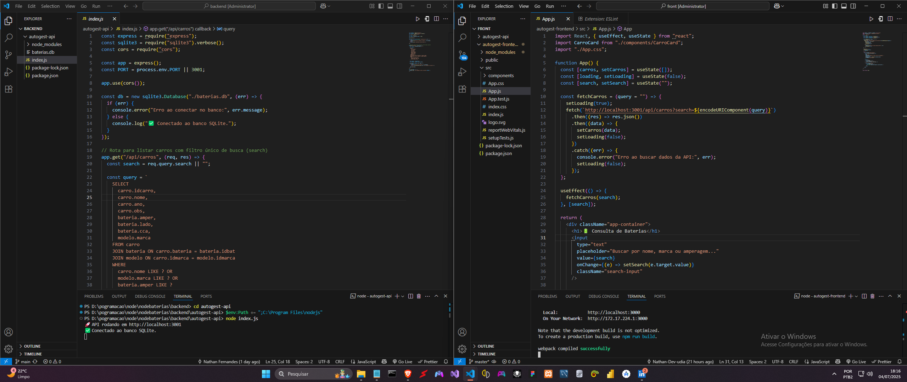

# 🔋 Consulta de Baterias para Veículos — Fullstack (React + Node.js)


Este é um projeto completo com **frontend em React.js** e **backend em Node.js + Express**, que fornece uma **API REST** para consulta de baterias automotivas.

O backend utiliza um banco de dados **SQLite** local para armazenar as informações de veículos e baterias, e expõe esses dados ao frontend por meio de endpoints RESTful em formato JSON.

Ideal para uso em oficinas, autocenters e sistemas internos de recomendação de baterias.

---

⚙️ **Contexto do Projeto**

Este projeto é uma evolução e complemento dos sistemas que desenvolvi anteriormente: **[Bateria Fácil](https://github.com/Nathan-Dev-udia/BateriaFacil)** e **[AutoGest](https://github.com/Nathan-Dev-udia/AutoGest)**.

Embora tenha arquitetura diferente — focada em uma API REST com Node.js e um frontend React — compartilha conceitos e tem o objetivo de oferecer uma solução mais moderna e escalável para consulta e recomendação de baterias em oficinas e autocenters.

💡 Vale ressaltar que o frontend ainda é simples e funcional, desenvolvido com foco em testar a comunicação com a API. Tenho plena consciência de que há espaço para melhorias visuais e de usabilidade — e já considero isso como próximo passo para evoluir ainda mais este projeto.

---

## 📦 Funcionalidades

- 🔍 Consulta interativa de baterias por modelo de carro
- 🏷️ Filtro por marca do veículo
- ⚡ Filtro por amperagem
- 📄 Retorno de dados técnicos como CCA, lado do polo, observações e mais
- 🌐 Interface web desenvolvida em React para visualização e busca

---

## 📷 Demonstração

### 🔍 Back e Front em atividade simultânea


### 🎞️ Funcionamento geral da aplicação


---

## 🚀 Como executar o projeto

Antes de começar, certifique-se de ter o **Node.js** instalado em sua máquina.  
Você pode baixá-lo aqui: [https://nodejs.org/pt/download](https://nodejs.org/pt/download)

Caso o VS Code não reconheça o Node nos comandos (`node`, `npm`, etc), execute no terminal:

```powershell
$env:Path += ";C:\Program Files\nodejs"
```
### 🔧 Backend (API - Node.js)
1. Acesse a pasta do backend:
```
cd autogest-api
```
2. Instale as dependências:
```
npm install
```
3. Inicie o servidor:
```
node index.js
```
A API estará disponível em: http://localhost:3001

### 💻 Frontend (Interface - React)
1. Acesse a pasta do frontend:
```
cd autogest-frontend
```
2. Instale as dependencias:
```
npm install
```
3. Inicie o projeto React:
```
npm start
```
O frontend estará disponível em: http://localhost:3000
*Obs: O frontend se comunica automaticamente com a API rodando na porta 3001, portanto é necessário deixar o backend ativo.*

### 📦 Criação do projeto (passos iniciais)
Caso você queira reproduzir esse projeto do zero:

Backend (API - Node.js + Express + SQLite)
```
mkdir autogest-api
cd autogest-api
npm init -y
npm install express sqlite3 cors
```
Frontend (React)
```
npx create-react-app autogest-frontend
```

### 🧩 Extensões recomendadas para o VS Code
- ES7+ React/Redux/React-Native snippets;
- Prettier - Code formatter;
- ESLint;
- npm Intellisense;
Essas extensões ajudam com formatação, sugestões de código e boas práticas durante o desenvolvimento.

---
## 📂 Estrutura do Projeto
```
.
├── autogest-api/ # Backend (Node.js + Express)
│ ├── index.js # Arquivo principal da API
│ ├── database.db # Banco SQLite com dados de carros e baterias
│ ├── routes/ # Rotas da API
│ └── ...
│
├── autogest-frontend/ # Frontend (React.js)
│ ├── public/ # Arquivos estáticos
│ ├── src/ # Código-fonte React
│ │ ├── components/ # Componentes reutilizáveis (como CarroCard)
│ │ ├── App.js # Componente principal
│ │ └── ...
│ ├── package.json # Configurações e dependências do React
│ └── ...
```
---

## 🧪 Endpoints

### 🔹 GET `/api/carros`
Retorna todos os veículos com informações de bateria.

**Exemplo de resposta:**
```json
[
  {
    "idcarro": 1,
    "nome": "CORSA",
    "ano": "2000-2014",
    "amper": "60",
    "lado": "DIR",
    "cca": "460",
    "marca": "CHEVROLET",
    "obs": null
  },
  ...
]
```
🔹 GET /api/carros?search=chevrolet
Filtra carros com base no nome, marca ou amperagem (case-insensitive).

---
## 🛠️ Tecnologias Utilizadas

### Backend
- Node.js
- Express
- SQLite
- CORS
- Nodemon (para desenvolvimento)

### Frontend
- React
- CSS
- Fetch API

---
## ⚠️ Observação
Este projeto foi desenvolvido como um caso de estudo, com o objetivo principal de entender a criação de uma API utilizando Node.js e Express, além de testar uma integração básica com React no frontend.

Atualmente, o banco de dados não possui uma quantidade tão volumosa de veículos e o frontend ainda está simples, focado em funcionalidade básica e teste da comunicação com a API.

Futuramente, planejo expandir a API para torná-la mais completa e robusta, incluindo um catálogo maior de carros, melhorias nos filtros e também aprimorar a interface do frontend, tornando-a mais moderna e amigável para o usuário, com melhor design e usabilidade.

---

> Desenvolvido por Nathan Fernandes Alves
